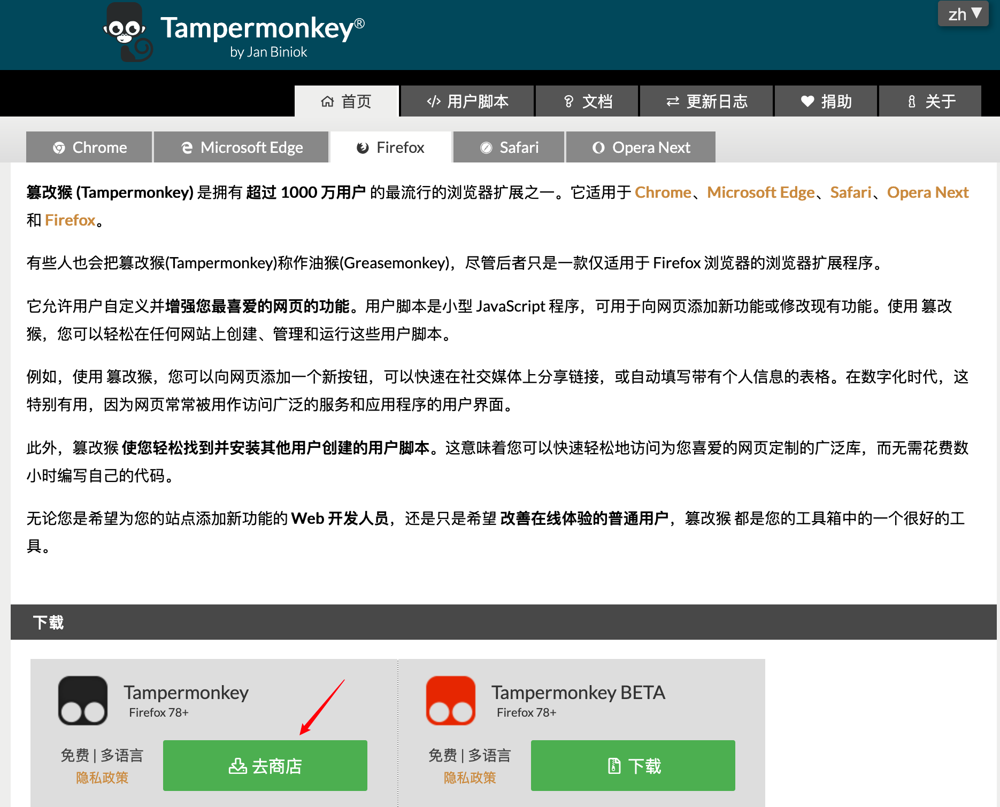
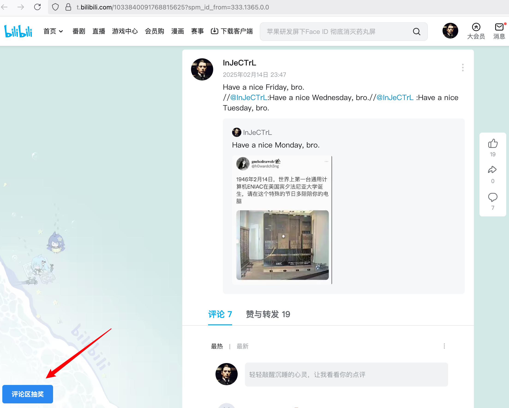
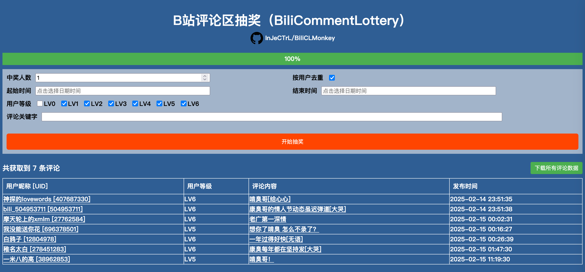
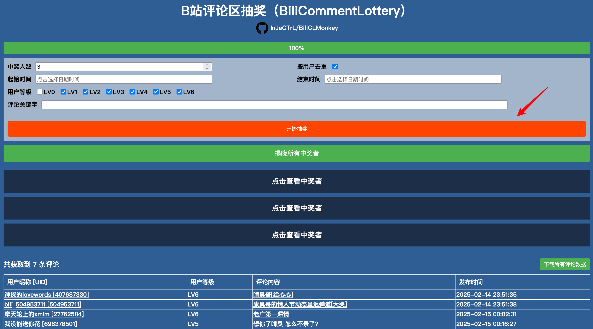
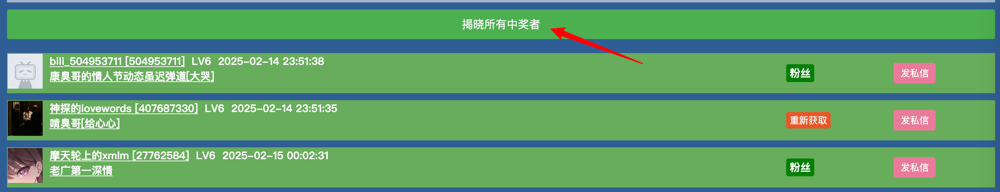
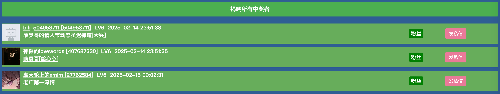

# BiliCLMonkey

> Bilibili评论区第三方抽奖插件（Tampermonkey）

## 介绍

本项目是之前[BiliCLOnline（B站评论区抽奖平台）](https://github.com/InJeCTrL/BiliCLOnline)的本地油猴插件版本，考虑到域名续期、服务器实例与带宽租赁的价格成本，以及后端服务维护成本、反反爬虫成本，将逐渐减少对原 BiliCLOnline 的开发和维护频率，转到新的 BiliCLMonkey 的开发和维护上来。

BiliCLMonkey 是依托于 Tampermonkey 的油猴插件，用户可以在任意一个安装了 Tampermonkey 插件管理器的浏览器上安装并使用 BiliCLMonkey，抽奖过程中的网络请求直接由浏览器发送到Bilibili，不依赖于其它后端服务，省去了原 BiliCLOnline 登录校验的麻烦，也避免了第三方登录可能导致的安全风险，这也方便检查中奖者是否是粉丝！

## 特点

- [x] 多浏览器通用（建议桌面端）
- [x] 支持视频稿件、专栏稿件、动态
- [x] 根据开始时间、截止时间筛选评论列表
- [x] 根据评论内容筛选评论列表
- [x] 根据用户等级筛选评论列表
- [x] 根据UID对评论去重
- [x] 判断中奖者是否是粉丝
- [x] 快捷跳转到发送私信

## 安装

1. 安装 Tampermonkey (**若已安装可跳过**)
   
   BiliCLMonkey 是依赖于 Tampermonkey 的浏览器插件，请先在浏览器访问 https://www.tampermonkey.net，将 Tampermonkey 添加到当前浏览器。

   

2. 安装
   
   **[>>> 点击此处安装 BiliCLMonkey <<<](https://github.com/InJeCTrL/BiliCLMonkey/releases/download/latest/bilicommentlottery.user.js)**

   目前支持视频稿件、专栏稿件、动态的ID

## 使用方法

**请在登录B站后使用！！！**

1. 打开任意一个视频 / 音频 / 专栏 / 动态，会发现左下角有 **“评论区抽奖”** 按钮
   

2. 直接点击它，会呼出 **“B站评论区抽奖面板”**
   
   面板显示正在获取评论：

   

   获取完成后会展示所有评论和抽奖条件：

   

3. 填写抽奖条件后点击 **“开始抽奖”**
   
   抽取完成后，下方会显示 **“揭晓所有中奖者”** 按钮和中奖者列表：

   

   直接点击中奖项，可以看到中奖者信息：

   

   包含了中奖者头像、昵称、UID、等级、评论发布时间、评论内容节选以及粉丝状态，现在可以方便地判断中奖者是否是粉丝了，并且右边有跳转到发私信按钮，点击后可以跳转到中奖者的私信对话框。
   
   想一次性开启所有中奖者，可以直接点击 **“揭晓所有中奖者”** 按钮：

   

   因为判断用户是否是粉丝可能会失败，所以如果开启中奖者之后，像上图一样显示了 **“重新获取”**，可以点击 **“重新获取”** 再次尝试获取中奖者是否是粉丝：

   

## 更新与其它说明

2024-02-15更新：

1. 实现初版功能
